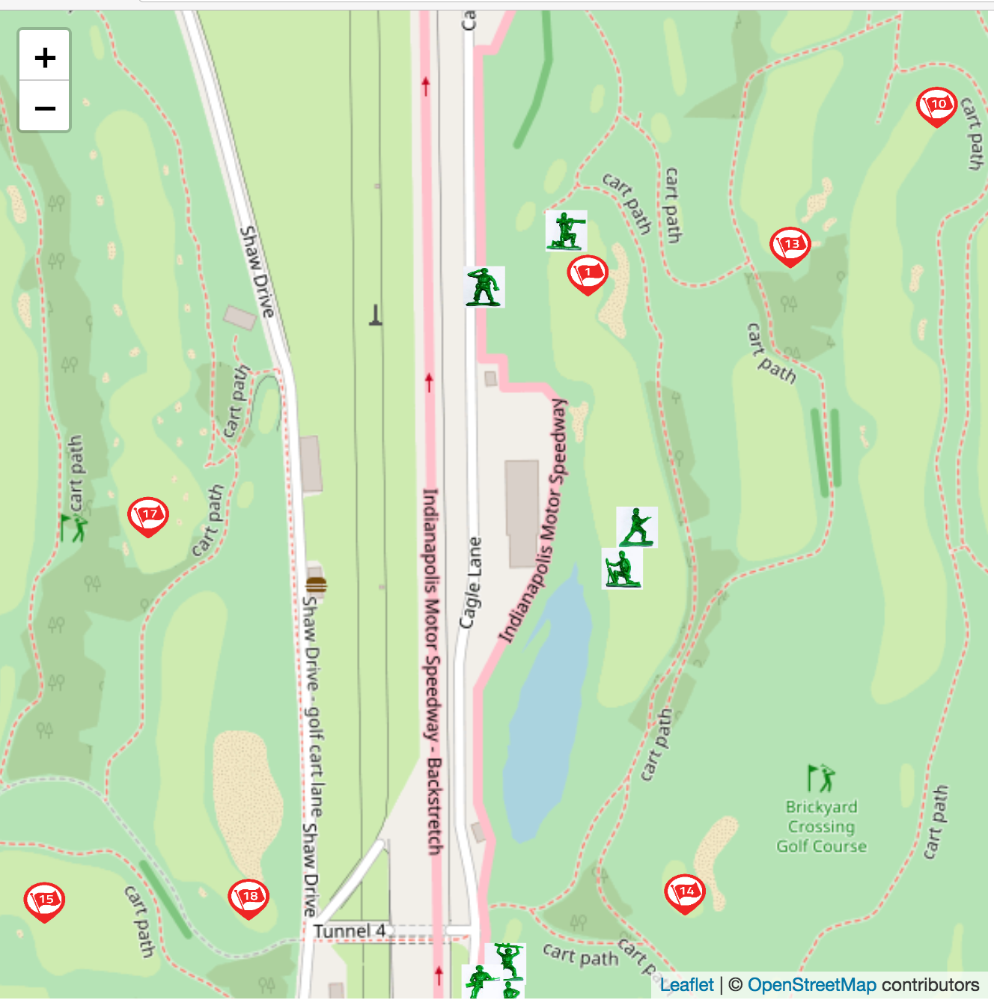

# This is an example of how to use React-Leaflet 

The code opens over a golf course. It shows flag markers and players arranged around different holes. The course is the Indianapolis Motor Speedway, West 16th Street, Indianapolis, IN (indy.json).

The players are represented by the toy soldier icons.  The golf course drawn from OpenStreet Map sources.  There is a lot you can do with OpenStreet Map.  This uses a VERY 
plain map tile set.

If you click on a player (one of the toy soldiers) you can see their name.

Notice there are several versions of this repo.  Master was the initial branch. It demonstrates how to use OpenStreet Map.  Branch addMobx shows how to implement both Mobx and GraphQL.

# Tech stack:
 
React

React-Leaflet

Mobx (v.5)

GraphQL (Apollo 2.X)

# To use:

make sure you have a fairly new node installation (I have node 9.X) 

use the following commands:

git clone https://github.com/muguira-james/toysoldiergolf

cd toysoldiergolf

npm install

npm start

## (or)

you can also use

cd toysoldiergolf

yarn

yarn start

# Software Roadmap

Here is a short list of the software

src/index.js - mostly graphql plumbing

src/App.js - main app and starting point, get iniial player information from the server

src/ShowMap.js - all things about the map.  Subscribe to player position updates

